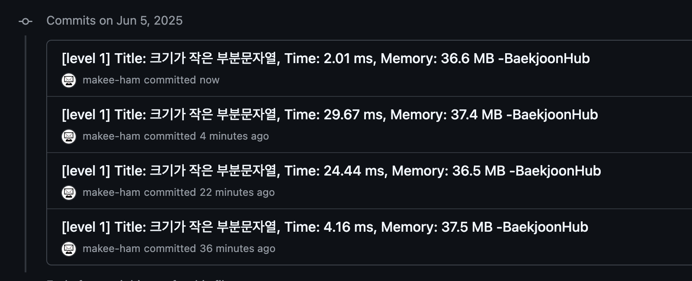

# 📘 Week 3 알고리즘 문제 풀이 기록

## ✅ 진행 날짜: 2025.06.02 ~ 2025.06.08

## 사용 언어: JavaScript

---

### Day 1 (06.02)

- 🔗 문제: [Lv 1) 피보나치 수 - 12945](https://school.programmers.co.kr/learn/courses/30/lessons/131128)
- 📁 코드: [재현 퀘스트 - 빈도수 세기 패턴 활용](https://github.com/makee-ham/algo-gogo/tree/main/%ED%94%84%EB%A1%9C%EA%B7%B8%EB%9E%98%EB%A8%B8%EC%8A%A4/1/131128.%E2%80%85%EC%88%AB%EC%9E%90%E2%80%85%EC%A7%9D%EA%BF%8D)
- 💡 메모: 문제가 있다. 성능이 너무 좋지 않다. (메모리: 206 MB, 시간: 781.22 ms) 아직 시간 복잡도를 측정하는 방법을 모르는데, **_다음 주 스터디 시간에 내 코드의 문제점, 시간 복잡도 줄일 개선 방법 등을 스터디원 분들께 여쭈어야 할 것 같다._** [코드](https://github.com/makee-ham/algo-gogo/blob/main/%ED%94%84%EB%A1%9C%EA%B7%B8%EB%9E%98%EB%A8%B8%EC%8A%A4/1/131128.%E2%80%85%EC%88%AB%EC%9E%90%E2%80%85%EC%A7%9D%EA%BF%8D/%EC%88%AB%EC%9E%90%E2%80%85%EC%A7%9D%EA%BF%8D.js)

### Day 2 (06.03)

- 선거일이라서 인천 놀러갔다 왔어요ㅎㅎ 다녀와서 심화반 플젝만 했네요ㅠㅠ

### Day 3 (06.04)

- 🔗 문제: [11. Container With Most Water(Med. level)](https://leetcode.com/problems/container-with-most-water/description/?envType=problem-list-v2&envId=two-pointers)
- 📁 코드: [재현퀘스트 - 다중 포인터 활용 Two Pointers 알고리즘 적용](https://github.com/makee-ham/algo-gogo/tree/main/0011-container-with-most-water)
- 💡 메모: 이번엔 방법 설계를 비교적 금방 했다! left랑 right index-pointer를 잡고, max 값을 업데이트 해가며 greedy하게? left index < right index일 동안의 경우를 전부 탐색했다! 공부한 걸 바로 적용하니 너무 재밌다. LeetCode 여기 문제 되게 좋네! 자주 가봐야겠다.

### Day 4 (06.05)

- 🔗 문제: [LV 1) 크기가 작은 부분문자열 - 147355](https://school.programmers.co.kr/learn/courses/30/lessons/147355)
- 📁 코드: [재현퀘스트 - sliding window pattern 과제 (리팩토링했더니 '브루트 포스 스타일 슬라이딩 윈도우'라는 혼종의 탄생 - 암튼 브루트 포스인데 이 경우에선 시간/메모리 성능 더 나음)](https://github.com/makee-ham/algo-gogo/tree/main/%ED%94%84%EB%A1%9C%EA%B7%B8%EB%9E%98%EB%A8%B8%EC%8A%A4/1/147355.%E2%80%85%ED%81%AC%EA%B8%B0%EA%B0%80%E2%80%85%EC%9E%91%EC%9D%80%E2%80%85%EB%B6%80%EB%B6%84%EB%AC%B8%EC%9E%90%EC%97%B4)
- 💡 메모: "음... 굳이 배열로 바꿨어야 했나? 메모리야 미안해..." 라는 생각에 나름대로 리팩토링 진행. 애초에 p의 길이만큼 문자열을 substring하고 이를 전체 문자열 길이에 p의 길이를 뺀 만큼 반복하여(어차피 뒤까지 빼오니까) 구했는데... 써보고 나니 이거, brute force인 것 같다...? <u>sliding window의 핵심은 "계산한 값을 **_누적_**해서 관리하는 것"에 있다.</u> window를 쭉쭉 밀면서 빠져나간 값은 빼고 새로 들어온 값은 더하고, 그런 식으로. 그런데 내가 한 두 번째 리팩토링(?) 버전은 "모든 i에 대해 t.substring(i, i + p.length)를 매번 잘라서 숫자로 바꿔서 비교"하기 때문에 **_윈도우마다 완전히 처음부터 새로 계산하는 구조_** 여서 brute force이면서도 생긴 건 또 p.length씩 슬라이드하는 구조이다. (그렇다. 이건 그냥 brute force이다.) 그런데 테스트 케이스가 이상한 건지 여기서는 brute force의 성능이 미묘하게 더 좋았다. 5ms랑 1MB 차이!...
- 참고: 그냥 아무것도 믿을 수 없다... 제출할 때마다 다르게 나온다(이미지 참고)... _난 이제 프로그래머스 불신증에 걸리고 말았다..._
  

### Day 5 (06.06)

- 🔗 문제: [Lv 0) 옹알이 (1) - 120956](https://school.programmers.co.kr/learn/courses/30/lessons/120956)
- 📁 코드: ["/"로 replace 후 every char가 "/"인지 확인](https://github.com/makee-ham/algo-gogo/tree/main/%ED%94%84%EB%A1%9C%EA%B7%B8%EB%9E%98%EB%A8%B8%EC%8A%A4/0/120956.%E2%80%85%EC%98%B9%EC%95%8C%EC%9D%B4%E2%80%85%EF%BC%881%EF%BC%89)
- 💡 메모: 음... 뭔가 아기가 발음할 수 있는 문자열 부분을 "/"로 replace하고, 그래서 문자열의 모든 char가 every를 써서 "/"로만 구성되어 있는지, 그렇다면 result++ 식으로 풀었는데... 탐탁지 않아서 스터디원 분들의 생각과 아이디어를 여쭈었다.

### Day 6 (06.07) + Day 7 (06.08)

- 한 주간 과제를 총망라한 실습을 해보느라 코테나 알고리즘 공부를 할 시간이 없었다...
- 그래도 혹시 모르니 레포지토리 공유!!! [키메라 투두](https://github.com/makee-ham/todo-list)

---

## 📌 이번 주 회고

- 얍
