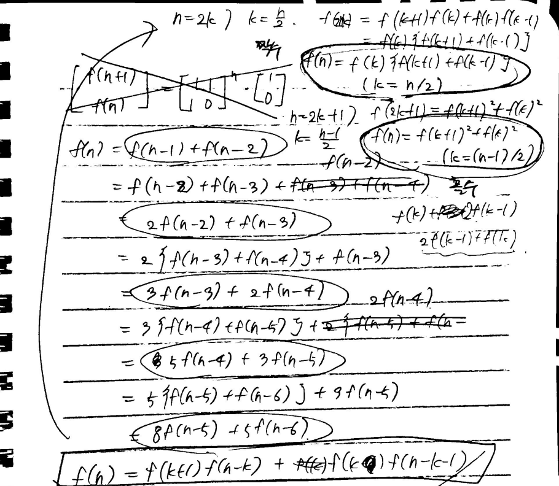

# 📘 Week 7 알고리즘 문제 풀이 기록

## ✅ 진행 날짜: 2025.06.30 ~ 2025.07.06

## 사용 언어: JavaScript

---

### Day 2 (07.01)

- 🔗 문제: [[level 3] 가장 긴 팰린드롬 - 12904](https://school.programmers.co.kr/learn/courses/30/lessons/12904)
- 📁 코드: [투포인터 중심 확장 풀이](https://github.com/sysysysyb/Study_Algorithm/tree/main/%ED%94%84%EB%A1%9C%EA%B7%B8%EB%9E%98%EB%A8%B8%EC%8A%A4/3/12904.%E2%80%85%EA%B0%80%EC%9E%A5%E2%80%85%EA%B8%B4%E2%80%85%ED%8C%B0%EB%A6%B0%EB%93%9C%EB%A1%AC)
- 💡 메모:

  ```javascript
  function solution(s) {
    let maxLen = 1;
    const sl = s.length;

    const findPalindrome = (left, right) => {
      while (left >= 0 && right < sl && s[left] === s[right]) {
        const len = right++ - left-- + 1;
        maxLen = Math.max(maxLen, len);
      }
    };

    for (const idx in s) {
      const nidx = Number(idx);
      findPalindrome(nidx - 1, nidx + 1); // 홀수
      findPalindrome(nidx, nidx + 1); // 짝수
    }

    return maxLen;
  }
  ```

  <h5>입출력 예</h5>
  <table class="table">
    <thead><tr>
      <th>s</th>
      <th>answer</th>
    </tr>
    </thead>
    <tbody><tr>
      <td>"abcdcba"</td>
      <td>7</td>
    </tr>
    <tr>
      <td>"abacde"</td>
      <td>3</td>
    </tr>
    </tbody>
  </table>

  팰린드롬을 어떻게 찾아내는 게 좋을지 고민하다가 **질문하기**에서 투포인터 패턴으로 중심에서부터 확장하는 방식을 이용해서 풀었다는 글을 보게 되었다. 그래서 양쪽 포인터로 사용할 index 값을 매개변수로 받아와 투포인터 패턴을 이용해 팰린드롬인지 검사하는 함수를 하나 만들어서 하나의 중심 index를 가지고 팰린드롬이 홀수일 때, 짝수일 때 둘 다 검증하는 방식으로 코드를 작성했다.

---

### Day 3 (07.02)

- 🔗 문제: [0088-merge-sorted-array](https://leetcode.com/problems/merge-sorted-array/description/?envType=problem-list-v2&envId=two-pointers)
- 📁 코드: [투포인터 문제 풀이](https://github.com/sysysysyb/Study_Algorithm/tree/main/%ED%94%84%EB%A1%9C%EA%B7%B8%EB%9E%98%EB%A8%B8%EC%8A%A4/1/147355.%E2%80%85%ED%81%AC%EA%B8%B0%EA%B0%80%E2%80%85%EC%9E%91%EC%9D%80%E2%80%85%EB%B6%80%EB%B6%84%EB%AC%B8%EC%9E%90%EC%97%B4)
- 💡 메모:

  ```javascript
  /**
   * @param {number[]} nums1
   * @param {number} m
   * @param {number[]} nums2
   * @param {number} n
   * @return {void} Do not return anything, modify nums1 in-place instead.
   */
  var merge = function (nums1, m, nums2, n) {
    let p_1 = m - 1;
    let p_2 = n - 1;
    let p_t = m + n - 1;

    while (p_2 >= 0) {
      if (nums1[p_1] >= nums2[p_2]) {
        nums1[p_t] = nums1[p_1--];
      } else {
        nums1[p_t] = nums2[p_2--];
      }
      p_t--;
    }
  };
  ```

  <h5>Example 1:</h5>
  <pre>
    <strong>Input:</strong> nums1 = [1,2,3,0,0,0], m = 3, nums2 = [2,5,6], n = 3
    <strong>Output:</strong> [1,2,2,3,5,6]
    <strong>Explanation:</strong> The arrays we are merging are [1,2,3] and [2,5,6].
    The result of the merge is [<u>1</u>,<u>2</u>,2,<u>3</u>,5,6] with the underlined elements coming from nums1.
  </pre>

  정답을 따로 반환하는 게 아니라 기존의 nums1 배열을 수정하기만 하면 되는 문제였다. nums1의 포인터, nums2의 포인터, 전체 포인터 변수를 만들고 값이 큰 순서대로 nums1 배열의 뒤에서부터 할당하도록 코드를 작성했다. nums1과 nums2 둘 다 오름차순으로 정렬이 이미 되어 있기 때문에 nums2 배열의 요소가 모두 nums1에 배치되었다면 남은 nums1은 이미 정렬된 상태이므로 더이상 정렬할 필요가 없어서 반복을 종료하도록 했다.

---

### Day 4 (07.03)

- 🔗 문제: [[level 1] 덧칠하기 - 161989](https://school.programmers.co.kr/learn/courses/30/lessons/161989)
- 📁 코드: [풀이](https://github.com/sysysysyb/Study_Algorithm/tree/ea9a3c4d5c39cdddcd9da3d2cab57b9d9f725adb/%ED%94%84%EB%A1%9C%EA%B7%B8%EB%9E%98%EB%A8%B8%EC%8A%A4/1/161989.%E2%80%85%EB%8D%A7%EC%B9%A0%ED%95%98%EA%B8%B0)
- 💡 메모:

  ```javascript
  function solution(n, m, section) {
    let cw = section[0]; // current wall
    let nw = cw + m - 1; // next wall
    let count = 1; // count

    for (const s of section) {
      if (s > nw) {
        cw = s;
        nw = cw + m - 1;
        count++;
      }
    }

    return count;
  }
  ```

  <h5>입출력 예</h5>
  <table class="table">
    <thead><tr>
      <th>n</th>
      <th>m</th>
      <th>section</th>
      <th>result</th>
    </tr>
    </thead>
    <tbody><tr>
      <td>8</td>
      <td>4</td>
      <td>[2, 3, 6]</td>
      <td>2</td>
    </tr>
    <tr>
      <td>5</td>
      <td>4</td>
      <td>[1, 3]</td>
      <td>1</td>
    </tr>
    <tr>
      <td>4</td>
      <td>1</td>
      <td>[1, 2, 3, 4]</td>
      <td>4</td>
    </tr>
    </tbody>
  </table>

  

  현재 페인트 칠이 가능한 첫번째 벽을 cw, 마지막 벽을 nw로 지정하고 for...of 반복문을 돌려서 요소가 nw보다 크면 페인트칠을 한 번 더 해야하기 때문에 count에 1을 더하는 식으로 코드를 작성했다.
  (지금 생각해보니 current wall이랑 next wall이 아니라 first wall, last wall라고 변수명을 지었으면 더 알아보기 쉬웠을 것 같다.)

---

## 📌 이번 주 회고

- 날이 너무 더워서 집중이 안된다... 최근에 typescript 공부를 추가로 하려고 하고 있는데 저번 주는 속도가 더뎠던 것 같아서 이번 AWS 파트 때는 과제를 좀 빨리 끝내고 진도를 팍팍 나가보려고 한다...
